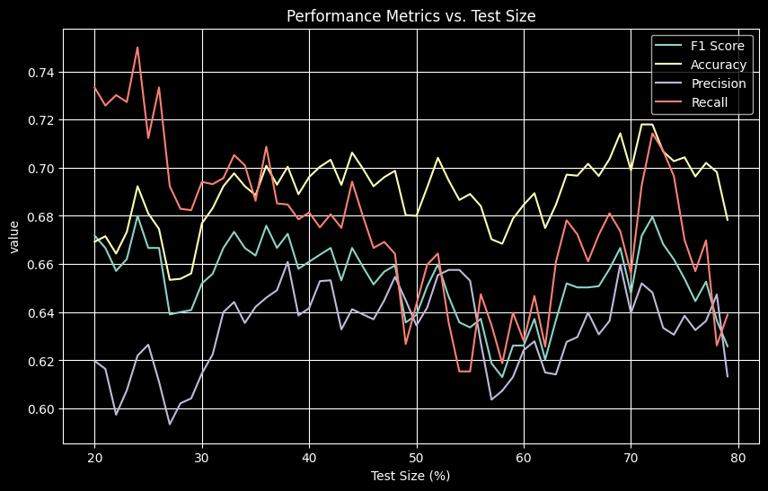

# EDM Final Project

## Introduction

This is a final project for EDM(Educational Data Mining, ~~not Electronic Dance Music~~) course.

## Data-preprocessing

The data is
from [Kaggle](https://www.kaggle.com/datasets/whenamancodes/alcohol-effects-on-study?select=Portuguese.csv).  
We use the Portuguese data in this project.  

### Data columns(30+3)
- school
- sex
- age
- address
- famsize
- Pstatus
- Medu
- Fedu
- Mjob
- Fjob
- reason
- guardian
- traveltime
- studytime
- failures
- schoolsup
- famsup
- paid
- activities
- nursery
- higher
- internet
- romantic
- famrel
- freetime
- goout
- Dalc
- Walc
- health
- absences
- G1
- G2
- G3

## Data preprocessing
### Data cleaning
Then we use [data_preprocess.py](models/data_preprocess.py) to handle non-numerical data.  
We define those students who get sum of G1, G2, G3 less than 36 as "fail" and others as "pass".

### PCA(optional)

We then follow [tutorial](https://leemeng.tw/essence-of-principal-component-analysis.html) to lower the dimension of data to 5.

PCA variance ratio =  [0.52424711 0.07050346 0.06545911 0.05062572 0.03483436]

## Results:

1. Logistic Regression: 
    - Logistic Regression 
       
    - Logistic Regression with PCA preprocessing 
       
2. k-Nearest Neighbors: 
    - k-Nearest Neighbors 
      .png) 
      .png) 
    - k-Nearest Neighbors with PCA preprocessing 
      .png) 
      .png) 
    -
