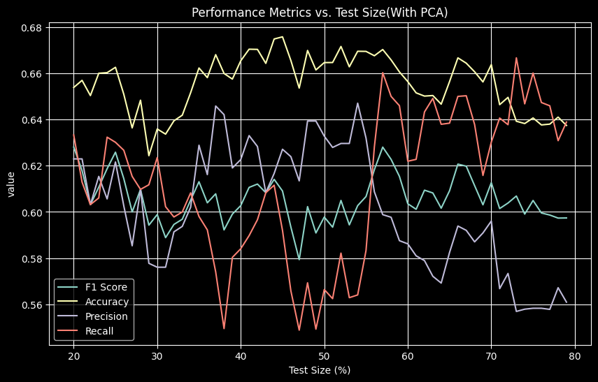

# EDM Final Project

## Introduction

This is a final project for EDM(Educational Data Mining, ~~not Electronic Dance Music~~) course.

## Data-preprocessing

The data is
from [Kaggle](https://www.kaggle.com/datasets/whenamancodes/alcohol-effects-on-study?select=Portuguese.csv).  
We use the Portuguese data in this project.  

### Data columns(30+3)
| Column       | Description                                                                                                    |
|--------------|----------------------------------------------------------------------------------------------------------------|
| school       | Student's school (binary: 'GP' - Gabriel Pereira or 'MS' - Mousinho da Silveira)                                |
| sex          | Student's sex (binary: 'F' - female or 'M' - male)                                                               |
| age          | Student's age (numeric: from 15 to 22)                                                                           |
| address      | Student's home address type (binary: 'U' - urban or 'R' - rural)                                                 |
| famsize      | Family size (binary: 'LE3' - less or equal to 3 or 'GT3' - greater than 3)                                      |
| Pstatus      | Parent's cohabitation status (binary: 'T' - living together or 'A' - apart)                                      |
| Medu         | Mother's education (numeric: 0 - none, 1 - primary education, 2 - 5th to 9th grade, 3 - secondary, 4 - higher) |
| Fedu         | Father's education (numeric: 0 - none, 1 - primary education, 2 - 5th to 9th grade, 3 - secondary, 4 - higher) |
| Mjob         | Mother's job (nominal: 'teacher', 'health', 'services', 'at_home' or 'other')                                    |
| Fjob         | Father's job (nominal: 'teacher', 'health', 'services', 'at_home' or 'other')                                    |
| reason       | Reason to choose this school (nominal: 'home', 'reputation', 'course' or 'other')                                |
| guardian     | Student's guardian (nominal: 'mother', 'father' or 'other')                                                       |
| traveltime   | Home to school travel time (numeric: 1 - <15 min., 2 - 15 to 30 min., 3 - 30 min. to 1 hour, 4 - >1 hour)      |
| studytime    | Weekly study time (numeric: 1 - <2 hours, 2 - 2 to 5 hours, 3 - 5 to 10 hours, 4 - >10 hours)                   |
| failures     | Number of past class failures (numeric: n if 1<=n<3, else 4)                                                     |
| schoolsup    | Extra educational support (binary: yes or no)                                                                    |
| famsup       | Family educational support (binary: yes or no)                                                                   |
| paid         | Extra paid classes within the course subject (binary: yes or no)                                                  |
| activities   | Extra-curricular activities (binary: yes or no)                                                                  |
| nursery      | Attended nursery school (binary: yes or no)                                                                      |
| higher       | Wants to take higher education (binary: yes or no)                                                                |
| internet     | Internet access at home (binary: yes or no)                                                                      |
| romantic     | With a romantic relationship (binary: yes or no)                                                                  |
| famrel       | Quality of family relationships (numeric: 1 - very bad to 5 - excellent)                                          |
| freetime     | Free time after school (numeric: 1 - very low to 5 - very high)                                                  |
| goout        | Going out with friends (numeric: 1 - very low to 5 - very high)                                                  |
| Dalc         | Workday alcohol consumption (numeric: 1 - very low to 5 - very high)                                             |
| Walc         | Weekend alcohol consumption (numeric: 1 - very low to 5 - very high)                                             |
| health       | Current health status (numeric: 1 - very bad to 5 - very good)                                                    |
| absences     | Number of school absences (numeric: from 0 to 93)                                                                |

## Data preprocessing
### Data cleaning
Then we use [data_preprocess.py](models/data_preprocess.py) to handle non-numerical data.  
We define those students who get sum of G1, G2, G3 less than 36 as "fail" and others as "pass".

### PCA(optional)

We then follow [tutorial](https://leemeng.tw/essence-of-principal-component-analysis.html) to lower the dimension of data to 5.

PCA variance ratio =  [0.52424711 0.07050346 0.06545911 0.05062572 0.03483436]

## Results:

1. Logistic Regression: 
    - Logistic Regression 
       
    - Logistic Regression with PCA preprocessing 
       
2. k-Nearest Neighbors: 
    - k-Nearest Neighbors 
      .png) 
      .png) 
    - k-Nearest Neighbors with PCA preprocessing 
      .png) 
      .png) 
